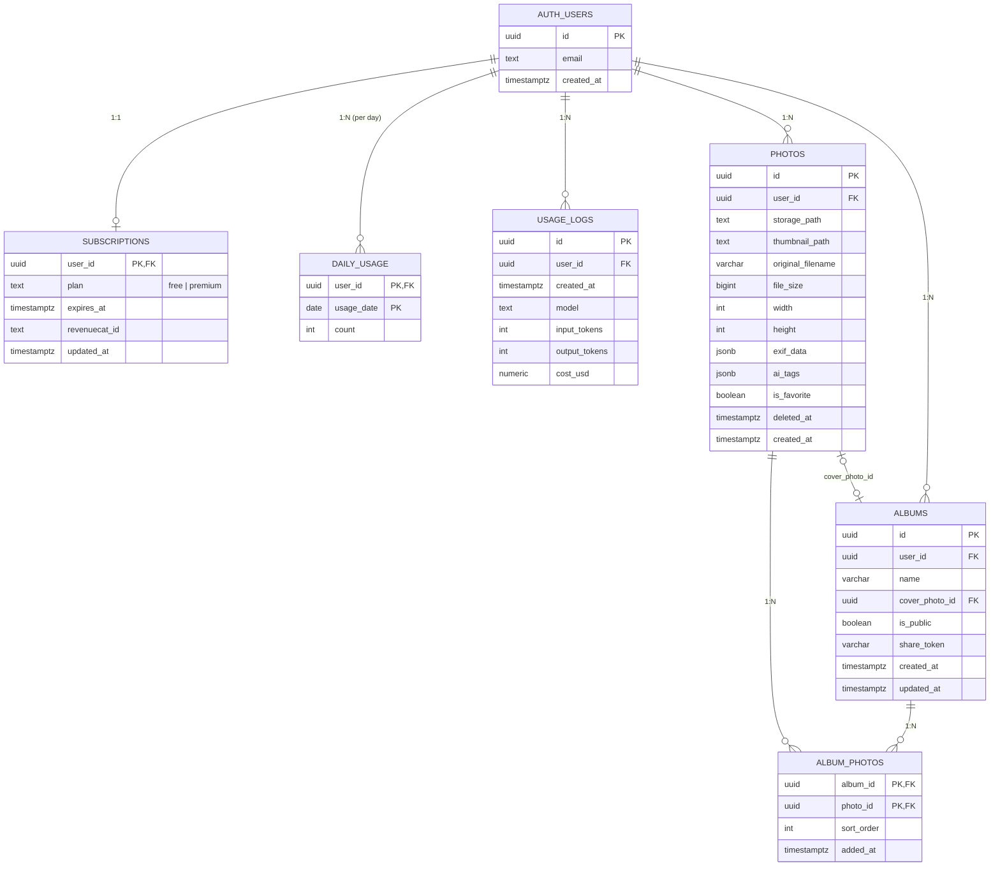

# dAIary ER 図

## 主要制約・インデックス

- 全テーブルで RLS 有効化
- `subscriptions.plan` は `CHECK (plan IN ('free', 'premium'))`
- `daily_usage` PK = `(user_id, usage_date)`（アトミック UPSERT 用）
- `photos`: 未削除 + 新着順インデックス、お気に入り部分インデックス、`ai_tags` GIN インデックス
- `album_photos` PK = `(album_id, photo_id)`
- `albums.cover_photo_id` は `ON DELETE SET NULL`
- `auth.users` 削除時は全関連テーブルが `ON DELETE CASCADE`

## RPC

- `increment_usage(p_user_id uuid) RETURNS int` — 当日 `daily_usage` を UPSERT で +1 し最新値を返す。`SECURITY DEFINER` + `service_role` のみ実行可
- `set_updated_at()` — `subscriptions` / `albums` の `BEFORE UPDATE` トリガーで `updated_at` を `now()` に更新
